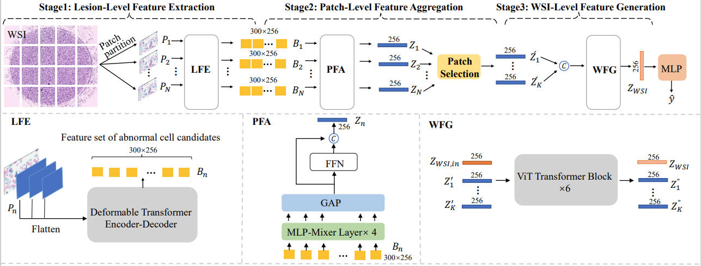
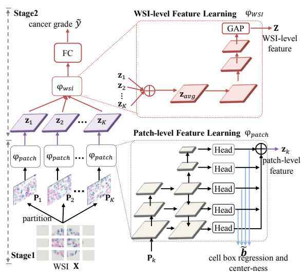

## 方法总览



论文地址：[[A Novel Transformer-Based Pipeline for Lung Cytopathological Whole Slide Image Classification]](https://www.academia.edu/download/103063627/10095365.pdf)

## 关键配置文件

* Deformable-DETR配置config文件（用于肺癌病灶检测）：
  * `mmdetection_tb_wsi/configs/deformable_detr_r50_16x2_50e_tct_ngc.py`
* Deformable-DETR + MLP-Mixer分类头配置config文件（用于肺癌病灶检测+patch图片分类）：
  * `mmdetection_tb_wsi/configs/deformable_detr_r50_16x2_50e_tct_ngc_with_clshead_v4.py`
* Vit配置config文件（用于WSI的最终分类）：
  * `mmclassification_tb_wsi/configs/_tct_ngc_/vit_tct_ngc.py`


## Pipeline指令流程

```
-------------------------------------------------------In mmdetection_tb_wsi----------------------------------------------------
# detection
PORT=12345 tools/dist_train.sh configs/deformable_detr_r50_16x2_50e_tct_ngc.py 4

#detection + classification head
PORT=12345 tools/dist_train.sh configs/deformable_detr_r50_16x2_50e_tct_ngc_with_clshead_v4.py 4

# generate smear
python tools/tct_ngc/generate_smear_test_json.py -j 20

PORT=12345 tools/dist_test_smear.sh\
configs/deformable_detr_r50_16x2_50e_tct_ngc_smear_v4.py [前两个阶段训练好的带分类头的检测模型.pth结尾] 4 --input [待提取的数据.json结尾] --output [保存路径]

#generate smear full
python tools/tct_ngc/new_generate_smear_cls_head_full.py -j -8

#split smear full
python tools/tct_ngc/new_split_smear_full.py

----------------------------------------------------In mmclassification_tb_wsi--------------------------------------------------
#wsi classification
PORT=12345 tools/dist_train.sh configs/_tct_ngc_/vit_tct_ngc.py 4
```


## 环境配置

* mmdetection_tb_wsi基于mmdetection_2.18.0而来，环境配置参考如下：

```
conda create -n tb_wsi_det python=3.7 -y
conda activate tb_wsi_det

2080：
conda install pytorch=1.8.1 cudatoolkit=10.2 torchvision=0.9.1 -c pytorch
pip install mmcv-full==1.3.16 -f https://download.openmmlab.com/mmcv/dist/cu102/torch1.8.0/index.html

3080：
conda install pytorch==1.9.0 torchvision==0.10.0 torchaudio==0.9.0 cudatoolkit=11.1 -c pytorch -c conda-forge
pip install mmcv-full==1.3.16  -f https://download.openmmlab.com/mmcv/dist/cu111/torch1.9.0/index.html

cd mmdetection_tb_wsi
pip install -r requirements/build.txt
pip install -v -e .
```

* mmclassification_tb_wsi环境配置参考:

```
conda create -n tb_wsi_cls python=3.7 -y
conda activate tb_wsi_cls

# cuda10
conda install pytorch==1.8.0 torchvision==0.9.0 torchaudio==0.8.0 cudatoolkit=10.2 -c pytorch -y
pip install mmcv-full==1.3.18  -f https://download.openmmlab.com/mmcv/dist/cu102/torch1.8.0/index.html -i https://pypi.douban.com/simple/

# cuda 11
conda install pytorch==1.8.0 torchvision==0.9.0 torchaudio==0.8.0 cudatoolkit=11.1 -c pytorch -c conda-forge -y
pip install mmcv-full==1.3.18  -f https://download.openmmlab.com/mmcv/dist/cu111/torch1.8.0/index.html -i https://pypi.douban.com/simple/

cd mmclassification_tb_wsi
chmod u+x tools/*
chmod u+x tools/*/*
pip install -r requirements.txt -i https://pypi.douban.com/simple/
pip install -v -e .  -i https://pypi.douban.com/simple/
```

## 引用

```BibTeX
@inproceedings{li2023novel,
  title={A Novel Transformer-Based Pipeline for Lung Cytopathological Whole Slide Image Classification},
  author={Li, Gaojie and Liu, Qing and Liu, Haotian and Liang, Yixiong},
  booktitle={ICASSP 2023-2023 IEEE International Conference on Acoustics, Speech and Signal Processing (ICASSP)},
  pages={1--5},
  year={2023},
  organization={IEEE}
}
```

## 补充：

原论文的实验结果均在4张NVIDIA 3080Ti上实验得来。

其中`mmdetection_grx`中包含了本课题组另一个方法:[Learning Deep Pathological Features for WSI-Level Cervical Cancer Grading](https://ieeexplore.ieee.org/abstract/document/9747112/)。

### 流程总览



将其稍加了修改以面向非妇科肺癌数据集，该方法是一个二阶段的pipeline。

### pipeline指令流程

```
# detection
PORT=12345 tools/dist_train.sh configs/_tct_ngc_/fcos-new_r50_caffe_fpn_gn-head_1x_tct-ngc.py 4

# generate smear
python tools/tct_ngc/generate_smear_test_json.py -j 20

PORT=12345 tools/dist_test_smear.sh configs/_tct_ngc_/faster_rcnn_r50_fpn_tct-ngc_smear.py  4 [第一阶段训练好的检测模型.pth结尾] 4 --input [待提取的数据.json结尾] --output [保存路径]

python tools/tct_ngc/generate_smear_full.py -j 8

python tools/tct_ngc/split_smear_full.py

#classification

cd mmclassification-tct

PORT=12345 tools/dist_train.sh configs/_tct_ngc_/resnet34_tct-ngc.py 4
```

### 引用

```BibTeX
@INPROCEEDINGS{9747112,
  author={Geng, Ruixiang and Liu, Qing and Feng, Shuo and Liang, Yixiong},
  booktitle={ICASSP 2022 - 2022 IEEE International Conference on Acoustics, Speech and Signal Processing (ICASSP)}, 
  title={Learning Deep Pathological Features for WSI-Level Cervical Cancer Grading}, 
  year={2022},
  volume={},
  number={},
  pages={1391-1395},
  doi={10.1109/ICASSP43922.2022.9747112}}
```

